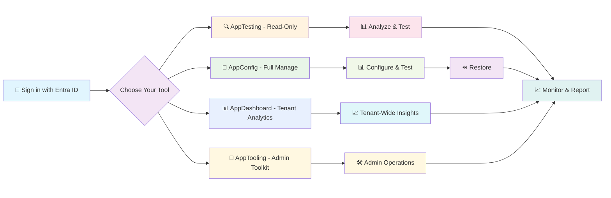

# AppConfig² Suite

  
  
<strong>Complete Application Management Suite for Microsoft Entra™ ID</strong>

---

## 🚀 What is AppConfig² Suite?

AppConfig² is a specialized application management suite designed specifically for Microsoft Entra ID application configuration, testing, troubleshooting, tenant-wide analytics, and Entra ID administration. The suite features four specialized tools designed for different organizational needs and compliance requirements. All tools provide powerful Microsoft Entra ID capabilities while serving distinct use cases.

### 🔧 AppConfig - Full Configuration Management
The go-to tool for developers and L2/L3 support teams who need full control over application configurations for advanced troubleshooting and testing, with comprehensive backup and restore capabilities.

### 🔍 AppTesting - Read-Only Analysis & Testing
A strictly read-only tool for organizations requiring configuration changes through the official Entra portal only, while maintaining comprehensive troubleshooting, authentication flow testing, and token analysis capabilities. No write permissions, no configuration risks.

### 📊 AppDashboard - Tenant Analytics & Security Insights
A read-only cross-tenant analytics tool for IT managers, security teams, and tenant administrators who need comprehensive visibility across every app registration in the tenant — security posture scoring, attack surface mapping, credential health tracking, and permission risk analysis. 100% client-side, zero infrastructure, zero write permissions.

### 🔨 AppTooling - Entra ID Administration Toolkit
Nine focused Entra ID management tools for privileged administration tasks that sit between the Azure Portal's form-based UI and scripted automation — for tasks too complex for Portal forms yet too infrequent to justify bespoke scripts. Covers consent audit and revocation, app role assignments, credential management, workload identity federation, claims mapping policies, manifest editing, optional claims configuration, an embedded Graph Explorer, and client-side JWT token decoding.

---

## 🎯 Who Is This Suite For?

<table>
<tr>
<td align="center" width="20%">

 <strong>L2/L3 Support Teams</strong>
 Advanced troubleshooting with both read-only (AppTesting) and full configuration (AppConfig) options — no more Fiddler, Postman, or portal context-switching
</td>
<td align="center" width="20%">

 <strong>Developers</strong>
 Test and iterate on authentication flows, validate token claims, and configure Entra ID integrations end-to-end
</td>
<td align="center" width="20%">

 <strong>Entra ID Admins</strong>
 AppConfig for app management, AppTooling for consent cleanup, credential rotation, workload identity federation, and policy configuration
</td>
<td align="center" width="20%">

 <strong>Security Engineers</strong>
 AppDashboard for security posture scoring, attack surface mapping, and permission risk analysis across the entire tenant
</td>
<td align="center" width="20%">

 <strong>IT Managers</strong>
 Tenant-wide analytics, security scorecards, and governance reporting via AppDashboard
</td>
</tr>
</table>

---

## ⭐ AppConfig² Suite Features

### 🌟 Core Capabilities (AppConfig & AppTesting)
- **🎫 Authentication Flow Testing** - Test various flows and inspect token responses
- **🔓 Advanced Token Analysis** - Decode and analyze OAuth/OIDC tokens with detailed claims
- **📊 Enhanced Dashboard** - Real-time application portfolio metrics and insights
- **� Application Lifecycle Tracking** - Monitor creation, ownership, and change history
- **🌐 Embedded Graph Explorer** - Deep dive analysis using Microsoft Graph API
- **📋 Conditional Access Analysis** - View applied policies and their authentication impact
- **🔍 Permission Review** - View configured delegated and application permissions for troubleshooting

#### 🧰 Built-in Suite Tools (Available in Both AppConfig & AppTesting)
- **Confidential Client Auth Debugger** - Test web applications (confidential clients) with Authorization Code Flow using minimal configuration (only redirect URI addition); supports PKCE, custom APIs, and full token inspection; automatic silent backup enables easy restoration
- **Token Scope Requester** - Request tokens for Graph or custom APIs with /.default, consent, and tenant authority controls; includes quick GET tester
- **Raw OAuth Tester** - Run implicit flow without MSAL, generate authorize URLs, validate state/nonce, and inspect tokens
- **OData Query Builder** - Build Graph OData queries visually, paginate, and export JSON
- **Entra Endpoints Explorer** - Comprehensive reference of Microsoft Entra ID endpoints across clouds (public, government, China, Germany) with variable substitution
- **MSAL Trace Viewer** - Real-time visibility into MSAL.js authentication events with correlation tracking, test actions, and detailed event inspection
- **OIDC Metadata Inspector** - Inspect OpenID Connect discovery documents, JWKS, validate JWT signatures, and analyze token claims across different authorities

### 🔧 AppConfig - Full Management Capabilities
- **📝 Complete App Lifecycle** - Create, configure, and manage applications end-to-end
- **🔄 Automatic Backups & Restore** - Tested application silently backed up with one-click restoration
- **👥 User Provisioning** - Provision and deprovision users with role assignments
- **🏷️ Dynamic App Roles** - Create and manage application roles with permissions
- **🗺️ Claims Mapping Policies** - Create, edit, and assign claims mapping policies
- **📦 Directory Extensions** - Manage custom directory extensions and attributes
- **🔑 Credential Management** - Generate and manage client secrets and certificates

### 🔍 AppTesting - Read-Only Analysis
- **✅ All Testing Capabilities** - Complete authentication flow testing without any configuration modifications
- **🛡️ Compliance Ready** - Meets strict organizational change control policies requiring Entra portal for all configuration changes
- **🔍 Permission Review** - View and inspect configured permissions for troubleshooting purposes
- **🔒 Safe Operation** - Zero risk of accidental configuration changes; all write functions disabled
- **👀 Deep Insights** - All authentication troubleshooting features with strictly read-only access

### 📊 AppDashboard - Tenant Analytics
- **🏠 Tenant Overview** — Full app registration inventory with health scorecard, 9 metric cards, click-to-filter, and CSV export
- **🛡️ Security Posture** — Per-app security scores (0–100), risk tiers (Critical/High/Medium/Low), and Top 5 Critical Apps panel
- **🎯 Attack Surface** — Attack vector mapping across Authentication, Credential, Privilege, and Exposure categories
- **⏱️ Secrets & Expiry** — Credential lifecycle tracking with expiry buckets and direct Azure Portal remediation links
- **📈 App Lifecycle** — Age distribution, creation trends, ownership analysis, and 4 visual charts
- **🔑 Permission Inventory** — Full OAuth2 and app-role catalog with risk classification and by-permission/by-app views

### 🔨 AppTooling - Administration Toolkit
- **🔐 Consent Manager** — Audit and revoke OAuth 2.0 delegated permission grants; distinguishes admin consent from user consent, surfaces granting user's UPN
- **👥 AppRole Assignment Manager** — View app role assignments from principal and resource perspectives; create and delete assignments with service principal search
- **🔑 Credential & Secret Manager** — Browse secrets and certificates across app registrations with colour-coded expiry; create new secrets with configurable lifetime
- **🌐 Workload Identity Federation** — Create and manage federated credentials with guided templates for GitHub Actions, Azure DevOps, Kubernetes, and Google Cloud
- **🗺️ Claims Mapping Policy Tool** — Full CRUD for `claimsMappingPolicy` objects with built-in templates; assign and unassign policies to service principals
- **📝 Application Manifest Editor** — Syntax-highlighted JSON editor with diff detection and unsaved-change prompts; saves via Graph JSON Merge Patch semantics
- **⚙️ Optional Claims Editor** — Configure optional claims (ID token, access token, SAML2) through a structured UI backed by a curated claim catalog
- **🌍 Graph Explorer** — Execute GET/POST/PATCH/DELETE Graph calls against v1.0 or beta; JIT scope consent, syntax-highlighted responses, built-in JWT decoder
- **🔍 JWT Token Decoder** — Client-side breakdown of any JWT with auto-detected type and validity, claims annotated by category, and Microsoft Docs links

---

## 📸 Suite Screenshots

### Application Dashboard

### Application Filtering

### Application Management

📱 <strong>View More Screenshots</strong>

### Troubleshooting Authentication as Different User

### Advanced Tools Suite

### Integrated Graph Explorer

---

## 🚦 How The Suite Works

### AppConfig Workflow
1. **🔐 Sign in** with your Microsoft Entra ID account
2. **🎯 Select** applications from your portfolio dashboard
3. **🔧 Configure** settings with automatic backup protection
4. **📊 Test** authentication flows and analyze results
5. **⏪ Restore** configurations using one-click restoration

### AppTesting Workflow
1. **🔐 Sign in** with your Microsoft Entra ID account
2. **🎯 Select** applications for analysis
3. **📊 Test** authentication flows without modification risks
4. **🔍 Analyze** configurations and identify issues
5. **📈 Report** findings while maintaining compliance

### AppDashboard Workflow
1. **🔐 Sign in** with your Microsoft Entra ID account
2. **🏠 View Tenant Overview** — instant inventory of every app registration with health scorecard
3. **🛡️ Explore Security Posture** — review per-app security scores and risk tiers
4. **🎯 Map Attack Surface** — identify attack vectors across authentication, credentials, privilege, and exposure
5. **📊 Analyze Lifecycle & Permissions** — trends, credential health, and permission risk across all apps
6. **📥 Export** any filtered view as CSV for audits and governance reports

---

## 🏁 Getting Started

### Choose Your Tool

**Need full configuration management?** → **AppConfig**
- Modify application settings
- Create and manage app roles
- Generate client secrets
- User provisioning capabilities
- Complete backup and restore

**Need read-only analysis only?** → **AppTesting**
- Comprehensive authentication flow testing without any configuration changes
- Compliance with strict change control policies
- Token analysis, permission review, and conditional access insights
- Risk-free, zero-write-permission operation

**Need tenant-wide security analytics?** → **AppDashboard**
- Security posture scoring across all apps simultaneously
- Attack surface mapping across authentication, credential, privilege, and exposure
- Credential health tracking with expiry buckets
- Permission risk analysis across the entire tenant
- 100% read-only, zero infrastructure, fully client-side

**Need Entra ID administration tools?** → **AppTooling**
- Consent audit and revocation across the tenant
- Credential and secret management across app registrations
- Workload identity federation setup (GitHub Actions, Azure DevOps, Kubernetes)
- Claims mapping policies and optional claims configuration
- Application manifest editing without raw JSON scripting

### Quick Start
1. Get the AppConfig² Suite on Azure Marketplace: <a href="https://azuremarketplace.microsoft.com/en-us/marketplace/apps?search=AppConfig%C2%B2&page=1" target="_blank" rel="noopener noreferrer">Open Azure Marketplace</a>
2. Choose your tool based on organizational requirements
3. Sign in with your Entra ID credentials
4. Explore the enhanced dashboard and portfolio insights
5. Start testing with comprehensive toolkit

---

## 🏗️ Technical Architecture

The AppConfig² Suite is built using modern web technologies optimized for enterprise identity management:

- **Frontend**: React 18+ with TypeScript and Material-UI
- **Authentication**: Microsoft Authentication Library (MSAL) 2.0
- **API Integration**: Microsoft Graph SDK with enhanced caching
- **State Management**: React Context with custom hooks and optimized caching
- **Security**: OAuth 2.0 / OpenID Connect compliant with zero-trust architecture

### Enhanced Features
- **Portfolio Dashboard**: Real-time application metrics and insights
- **Advanced Caching**: Optimized performance with intelligent data caching
- **Export Capabilities**: CSV exports for security and lifecycle analysis
- **Lifecycle Tracking**: Complete application creation and change history

---

## 🔒 Security & Compliance

The AppConfig² Suite follows enterprise security best practices:

- **🔐 Zero Secrets Storage** - No application secrets or credentials stored
- **🎫 Token-Based Access** - All operations use delegated permissions
- **🛡️ Principle of Least Privilege** - Minimal required permissions only
- **🔄 Automatic Backups** - Safety nets for all modifications (AppConfig)
- **📊 Compliance Ready** - Read-only option for strict change control (AppTesting)
- **🛡️ Zero Trust Architecture** - Never trust, always verify approach

---

## 📚 Suite Documentation

- **[AppConfig² Features Guide](./Features%20Guide.md)** - Comprehensive suite feature documentation
- **[Architecture Overview](./Architecture%20Overview.md)** - Technical architecture and design decisions

---

## 🤝 Contributing

We welcome contributions from the community! Whether you're reporting bugs, suggesting features, or contributing code, please read our [Contributing Guidelines](./CONTRIBUTING.md).

### Ways to Contribute
- 🐛 **Report Issues** - Help us identify and fix bugs across tools
- 💡 **Suggest Features** - Share ideas for new functionality in either tool
- 📖 **Improve Documentation** - Help make our comprehensive docs better
- 🧪 **Beta Testing** - Join our early access program for the complete suite

---

## 🛒 Azure Marketplace Availability

Now available on Azure Marketplace:
- 1-month free trial of the full AppConfig² Suite
- Azure-native billing and subscription management
- Enterprise-ready security and compliance
- Professional technical support

Get it on Azure Marketplace:
<a href="https://azuremarketplace.microsoft.com/en-us/marketplace/apps?search=AppConfig%C2%B2&page=1" target="_blank" rel="noopener noreferrer">Open Azure Marketplace</a>

---

## 📞 Support & Community

- **🌐 Website**: [www.appconfig.eu](https://www.appconfig.eu/)
- **💼 LinkedIn**: [AppConfig² Company Page](https://www.linkedin.com/company/appconfig-square/)
- **📧 Email**: [support@appconfig.app](mailto:support@appconfig.app)

---

## 📄 License

This project is proprietary software. All rights reserved. See [LICENSE](./LICENSE.md) for details.

---

## 🙏 Acknowledgments

- **Microsoft** for the comprehensive Entra ID and Graph API ecosystem
- **Early Access Users** for valuable feedback and testing across tools
- **Enterprise Partners** for guidance on compliance and organizational requirements

---

  <h3>🚀 Get it on Azure Marketplace</h3>
  
Deploy AppConfig² Suite with Azure-native billing and compliance.

  

---

  Built with ❤️ for the Microsoft Entra ID community

